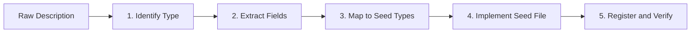

# Plan: Turning a Description Into a Full Seed File

A generalized workflow for converting raw rulebook/ source descriptions into complete Faradhaven seed files. Use this for races, classes, or other seedable content.

---

## Overview



---

## Step 1: Identify the Seed Type

| Type  | Package                            | Output File       | Seed Struct           |
| ----- | ---------------------------------- | ----------------- | --------------------- |
| Race  | `backend/seed/faradhaven_races/`   | `<race_name>.go`  | `FaradhavenRaceSeed`  |
| Class | `backend/seed/faradhaven_classes/` | `<class_name>.go` | `FaradhavenClassSeed` |

Choose based on the description content (species/ancestry vs profession/archetype).

---

## Step 2: Extract Fields from the Description

### For Races

| Extract       | Look for in description                        | Example                         |
| ------------- | ---------------------------------------------- | ------------------------------- |
| Name          | Title or heading                               | "Aasimar"                       |
| Flavor text   | Introductory paragraph(s)                      | Lifespan, appearance, origin    |
| Creature Type | Usually stated                                 | "Humanoid"                      |
| Size          | Explicit or implied                            | "Medium", "Small or Medium"     |
| Speed         | Feet per round                                 | "30 feet" → 30                  |
| Abilities     | Bulleted traits, each with a name and mechanic | Darkvision, Healing Hands, etc. |

### For Classes

| Extract         | Look for in description    | Example                        |
| --------------- | -------------------------- | ------------------------------ |
| Name            | Title                      | "The Rift Weaver"              |
| Hit Die         | e.g., "d8"                 | 8                              |
| Primary Ability | Main stat                  | "intelligence"                 |
| Archetype       | Role label                 | "Full Caster / Evoker"         |
| Concept         | 1–2 sentence pitch         | "A scholar who opens rifts..." |
| Class Features  | Level 1 abilities          | Bulleted list                  |
| Proficiencies   | Weapons, armor, saves      | From tables                    |
| Skill choices   | "Choose X from"            | Array of options               |
| Level features  | Level-by-level progression | Map level → feature text       |

---

## Step 3: Map Extracted Data to Seed Types

### Race Mapping

```
Description block        →  FaradhavenRaceSeed
  - Intro paragraph      →  Description
  - Creature Type        →  CreatureType
  - Size                 →  Size
  - Speed                →  BaseSpeed

Each ability/trait       →  TraitSeed
  - Trait name           →  Name
  - Full mechanic text   →  Description
  - "As an Action" etc.  →  ActionType
  - "X per long rest"    →  UsesPerRest, ResetCondition
  - "60 feet"            →  RangeValue
  - "15ft cone"          →  AreaOfEffect
  - "DEX save"           →  SaveAbility
  - "At level 3"         →  LevelReq

If "choose one of:"      →  TraitOptionSeed per option
  - Option name          →  Name
  - Option mechanic      →  Description
```

### Class Mapping

```
Description block        →  FaradhavenClassSeed
  - Name, hit die, etc.  →  Top-level fields
  - Level 1 features     →  ClassFeatures (array)
  - Proficiencies        →  Proficiencies, Tools, SavingThrows
  - Skills               →  SkillChoice, DnDSkillFocus

Level N feature text     →  LevelFeatures[N]
  - "Name — Description" →  parseFeature format
  - ASI at 4,8,12,16,19  →  "Ability Score Improvement — ..."
```

---

## Step 4: Implement the Seed File

### Race Template

```go
// backend/seed/faradhaven_races/<name>.go
package faradhaven_races

func RaceName() FaradhavenRaceSeed {
    return FaradhavenRaceSeed{
        Name:         "Race Name",
        Description:  "...",  // full flavor
        CreatureType: "Humanoid",
        Size:         "Medium",
        BaseSpeed:    30,
        Traits:       raceNameTraits(),
    }
}

func raceNameTraits() []TraitSeed {
    return []TraitSeed{
        {Name: "...", Description: "...", LevelReq: 1, ActionType: "Passive"},
        // Add Options: []TraitOptionSeed{...} when trait has choices
    }
}
```

### Class Template

```go
// backend/seed/faradhaven_classes/<name>.go
package faradhaven_classes

func ClassName() FaradhavenClassSeed {
    return FaradhavenClassSeed{
        Name:           "The Class Name",
        HitDie:         8,
        PrimaryAbility: "intelligence",
        Archetype:      "...",
        Concept:        "...",
        ClassFeatures:  []string{"Feature 1", "Feature 2"},
        DnDSkillFocus:  []string{"Arcana", "Nature"},
        Proficiencies:  "...",
        SkillChoice:    []string{...},
        Tools:          []string{...},
        SavingThrows:   []string{...},
        StartingEquip:  []string{...},
        LevelFeatures:  classNameLevelFeatures(),
    }
}

func classNameLevelFeatures() map[int]string {
    return map[int]string{
        1:  "Feature Name — Description.",
        4:  "Ability Score Improvement — ...",
        // 2–20 as needed
    }
}
```

---

## Step 5: Register and Verify

### Register

- **Race**: Add `RaceName()` to `AllRaces()` in `backend/seed/faradhaven_races/seed.go`
- **Class**: Add `ClassName()` to `AllClasses()` in `backend/seed/faradhaven_classes/seed.go`

### Verify

1. `cd backend && go build ./...`
2. Run the app; check logs for "Created race: X" or "Created class: X"
3. Query the API or DB to confirm records exist with correct nested data

---

## Quick Reference: Source Phrase → Field

| Source phrase                 | Race field                                    | Class field                    |
| ----------------------------- | --------------------------------------------- | ------------------------------ |
| "Humanoid"                    | CreatureType                                  | —                              |
| "Medium (4–7 ft)"             | Size                                          | —                              |
| "30 feet"                     | BaseSpeed                                     | —                              |
| "As an Action"                | ActionType                                    | —                              |
| "Once per long rest"          | UsesPerRest: "1", ResetCondition: "Long Rest" | —                              |
| "choose one of the following" | Options (TraitOptionSeed)                     | —                              |
| "60 feet"                     | RangeValue                                    | —                              |
| "Dexterity save"              | SaveAbility: "DEX"                            | —                              |
| "When you reach level 3"      | LevelReq: 3                                   | —                              |
| Hit die d8                    | —                                             | HitDie: 8                      |
| "Choose 2 from"               | —                                             | SkillChoice + SkillChoiceCount |

---

## Reference Docs

- [backend/docs/RACE_SEED_GUIDE.md](backend/docs/RACE_SEED_GUIDE.md) — Detailed race seed guide
- [backend/seed/faradhaven_races/aasimar.go](backend/seed/faradhaven_races/aasimar.go) — Race example
- [backend/seed/faradhaven_classes/rift_weaver.go](backend/seed/faradhaven_classes/rift_weaver.go) — Class example
