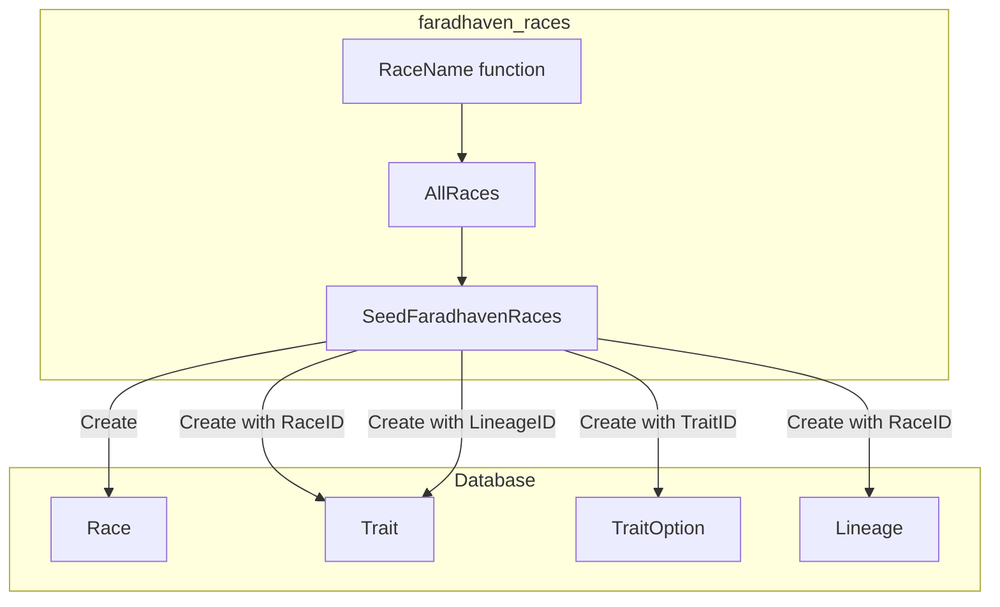

# Race Seed Guide

A step-by-step guide for adding any race to Faradhaven using the `faradhaven_races` seed package. Apply this process to Aasimar, Elf, Dragonborn, or any other race.

---

## 1. Understand the Models

### Race Hierarchy

| Model           | Purpose                                 | When to Use                                                                                                |
| --------------- | --------------------------------------- | ---------------------------------------------------------------------------------------------------------- |
| **Race**        | Base species (Elf, Aasimar, Dragonborn) | Every race has one                                                                                         |
| **Trait**       | Abilities tied to the race or a lineage | Any mechanical ability (Darkvision, Breath Weapon, etc.)                                                   |
| **TraitOption** | Sub-choices within a trait              | When a trait offers multiple choices (e.g., Necrotic Shroud vs Heavenly Wings, or Draconic ancestry color) |
| **Lineage**     | Sub-races with their own traits         | When the race has distinct sub-types (Wood Elf, High Elf, Gold Dragonborn)                                 |

### Decision: Trait vs Lineage vs TraitOption

- **Trait**: A single ability all members of the race (or lineage) get.
- **TraitOption**: One trait, multiple mutually exclusive options the player picks. Use when the trait text says "choose one of the following."
- **Lineage**: A sub-type of the race with its own traits. Use when the race has distinct sub-races (e.g., Elf → Wood Elf, High Elf, Dark Elf).

### Model Fields Quick Reference

**Race** (`backend/models/race.go`)

- `Name`, `Description`, `CreatureType`, `Size`, `BaseSpeed`

**Trait** (`backend/models/trait.go`)

- `Name`, `Description`, `LevelReq` (default 1)
- `ActionType`: "Passive", "Action", "Bonus Action", "Reaction", "Magic Action"
- `UsesPerRest`, `ResetCondition`: "Long Rest", "Short Rest"
- `RangeValue`, `AreaOfEffect`, `SaveAbility` (DEX, CON, CHA, etc.)
- `RaceID` OR `LineageID` (one must be set)

**TraitOption** (`backend/models/trait_option.go`)

- `Name`, `Description`, `SpellName` (optional, for spell-granting options)

**Lineage** (`backend/models/lineage.go`)

- `Name`, `Description`, `RaceID`
- `DamageType` (optional, e.g., Fire for Gold Dragonborn)

---

## 2. Package Structure

```
backend/seed/faradhaven_races/
├── types.go      # FaradhavenRaceSeed, TraitSeed, TraitOptionSeed, LineageSeed
├── seed.go       # AllRaces(), SeedFaradhavenRaces()
└── <race_name>.go   # One file per race: Aasimar(), Elf(), Dragonborn(), etc.
```

---

## 3. Add a New Race: Checklist

### Step 1: Create the race file

Create `backend/seed/faradhaven_races/<race_name>.go` (e.g., `aasimar.go`, `elf.go`).

### Step 2: Return a FaradhavenRaceSeed

Fill in the race-level fields:

| Field        | Source                                                | Example                               |
| ------------ | ----------------------------------------------------- | ------------------------------------- |
| Name         | Race name                                             | `"Aasimar"`                           |
| Description  | Flavor text, lifespan, appearance hints               | Full paragraph from source            |
| CreatureType | Usually Humanoid                                      | `"Humanoid"`                          |
| Size         | From source (Tiny, Small, Medium, Large, or "X or Y") | `"Medium (4–7 ft) or Small (2–4 ft)"` |
| BaseSpeed    | Feet per round                                        | `30`                                  |
| Traits       | See Step 3                                            | `[]TraitSeed{...}`                    |
| Lineages     | Only if race has sub-races                            | `nil` or `[]LineageSeed{...}`         |

### Step 3: Add traits

For each ability in the race, create a `TraitSeed`:

| Trait Field    | When to Set           | Examples                                                        |
| -------------- | --------------------- | --------------------------------------------------------------- |
| Name           | Always                | `"Darkvision"`, `"Healing Hands"`                               |
| Description    | Always                | Full mechanical text                                            |
| LevelReq       | If gained later       | `1` (default), `3` for level-gated traits                       |
| ActionType     | If it costs an action | "Passive", "Action", "Bonus Action", "Reaction", "Magic Action" |
| UsesPerRest    | If limited use        | `"1"`, `"Proficiency Bonus"`                                    |
| ResetCondition | If limited use        | `"Long Rest"`, `"Short Rest"`                                   |
| RangeValue     | If it has range       | `"60"` (feet), `"30"`                                           |
| AreaOfEffect   | If AOE                | `"15ft Cone"`, `"10-foot radius"`                               |
| SaveAbility    | If forces a save      | `"DEX"`, `"CON"`, `"CHA"`                                       |
| Options        | If "choose one of"    | `[]TraitOptionSeed{...}`                                        |

### Step 4: Add TraitOptions (when the trait has choices)

When a trait says "choose one of the following" or lists options:

```go
Options: []TraitOptionSeed{
    {Name: "Heavenly Wings", Description: "Two spectral wings... Fly Speed equal to your Speed."},
    {Name: "Inner Radiance", Description: "Searing light... shed Bright Light..."},
    {Name: "Necrotic Shroud", Description: "Eyes become pools of darkness... Frightened..."},
},
```

### Step 5: Add Lineages (when the race has sub-races)

If the race has sub-races (e.g., Elf → Wood Elf, High Elf):

```go
Lineages: []LineageSeed{
    {
        Name:        "Wood Elf",
        Description: "...",
        Traits:      []TraitSeed{...},  // Traits unique to Wood Elf
    },
    {
        Name:        "High Elf",
        Description: "...",
        Traits:      []TraitSeed{...},
    },
},
```

Traits on a lineage use `LineageID` instead of `RaceID` when persisted.

### Step 6: Register in AllRaces()

In `seed.go`, add your race to the slice:

```go
func AllRaces() []FaradhavenRaceSeed {
    return []FaradhavenRaceSeed{
        Aasimar(),
        Elf(),        // add new races here
        Dragonborn(),
    }
}
```

---

## 4. Seed Types (types.go)

Ensure `types.go` defines:

```go
type FaradhavenRaceSeed struct {
    Name         string
    Description  string
    CreatureType string
    Size         string
    BaseSpeed    int
    Traits       []TraitSeed
    Lineages     []LineageSeed  // optional
}

type TraitSeed struct {
    Name           string
    Description    string
    LevelReq       int
    ActionType     string
    UsesPerRest    string
    ResetCondition string
    RangeValue     string
    AreaOfEffect   string
    SaveAbility    string
    Options        []TraitOptionSeed  // optional
}

type TraitOptionSeed struct {
    Name        string
    Description string
    SpellName   string  // optional, for spell-granting options
}

type LineageSeed struct {
    Name        string
    Description string
    DamageType  string  // optional
    Traits      []TraitSeed
}
```

---

## 5. Seed Logic (seed.go)

`SeedFaradhavenRaces(db)` should:

1. Loop over `AllRaces()`.
2. For each race: if a Race with that name exists → skip.
3. Else:
   - Create Race.
   - For each TraitSeed: create Trait with `RaceID` (or `LineageID` if from a lineage).
   - For each TraitOptionSeed: create TraitOption with `TraitID`.
   - For each LineageSeed: create Lineage with `RaceID`, then create its traits with `LineageID`.

---

## 6. Data Flow



---

## 7. Example: Mapping Source Text to TraitSeed

**Source**: "Darkvision. You have Darkvision with a range of 60 feet."

| Field       | Value                                          |
| ----------- | ---------------------------------------------- |
| Name        | "Darkvision"                                   |
| Description | "You have Darkvision with a range of 60 feet." |
| LevelReq    | 1                                              |
| ActionType  | "Passive"                                      |
| RangeValue  | "60"                                           |
| Options     | nil                                            |

**Source**: "Healing Hands. As a Magic action, you touch a creature and roll a number of d4s equal to your Proficiency Bonus. The creature regains Hit Points equal to the total. Once you use this trait, you can't use it again until you finish a Long Rest."

| Field          | Value               |
| -------------- | ------------------- |
| Name           | "Healing Hands"     |
| Description    | (full text)         |
| LevelReq       | 1                   |
| ActionType     | "Magic Action"      |
| UsesPerRest    | "Proficiency Bonus" |
| ResetCondition | "Long Rest"         |
| Options        | nil                 |

**Source**: "Celestial Revelation. When you reach level 3, you can transform as a Bonus Action using one of the options below (choose each time). ... Heavenly Wings. ... Inner Radiance. ... Necrotic Shroud. ..."

| Field          | Value                                           |
| -------------- | ----------------------------------------------- |
| Name           | "Celestial Revelation"                          |
| Description    | (transformation rules, extra damage, etc.)      |
| LevelReq       | 3                                               |
| ActionType     | "Bonus Action"                                  |
| UsesPerRest    | "1"                                             |
| ResetCondition | "Long Rest"                                     |
| Options        | Heavenly Wings, Inner Radiance, Necrotic Shroud |

---

## 8. Server Wiring

Ensure `backend/api/server.go` calls the race seed after other seeds:

```go
if err := faradhaven_races.SeedFaradhavenRaces(database.DB()); err != nil {
    log.Warn().Err(err).Msg("Seed Faradhaven races skipped or failed")
}
```

---

## 9. Minimal placeholder seeds

The legacy `models.SeedRacesIfEmpty` helper (which added placeholder races such as Human, Elf, and Dwarf) has been removed. The Faradhaven seed package now provides the authoritative race data, so no additional placeholder entries are created.
